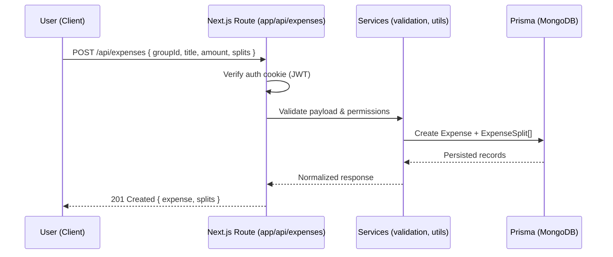

## ExpenseSplitter — Production‑Ready Expense Sharing App

Modern split‑expense platform built with Next.js 15, React 19, Prisma, and MongoDB. Create groups, add expenses, split fairly (equal or custom), and settle optimally. Production concerns (auth, data integrity, performance, DX) are implemented end‑to‑end.

### Hiring manager TL;DR
- Built, tested, and deployed a full‑stack product solo
- Secure auth (JWT httpOnly), solid data model, clean API boundaries
- Clear code you can extend on day one; fast feedback loop and documentation

### Live demo & access
- Demo: add your deployment URL
- Test user: add a seeded user or register quickly
- Screenshots: add 2–3 images (Dashboard, Add Expense, Settlements)

---

## What I’ll bring to your team
- Bias to deliver: small, safe iterations with visible value
- Pragmatic engineering: clear ownership boundaries, typed contracts, automated checks
- Product sense: UX that reduces friction and makes state obvious

---

## Highlights
- Authentication: JWT (httpOnly cookie), bcrypt password hashing, defensive checks
- Ledger logic: expense splits, member balances, optimal settlements
- API: `app/api/*` route handlers with validation and predictable error shapes
- Data: Prisma + MongoDB with well‑defined relations and unique constraints
- UI: Next.js App Router + Tailwind; accessible, responsive, and keyboard‑friendly

---

## Architecture
- UI: server components for data fetching; client components for interactivity
- API: auth, users, groups, expenses, settlements under `app/api/*`
- Data: `prisma/schema.prisma` (User, Group, GroupMember, Expense, ExpenseSplit, Settlement, Friend)
- Auth: `app/lib/auth.ts` (sign/verify JWT, cookie options, guards)
- Utils: `app/lib/settlementUtils.ts` (calculations)

Key files to review:
- `app/lib/auth.ts` — JWT sign/verify and cookie options
- `app/api/auth/*` — login/register/me/logout flows
- `app/api/groups/[id]/*` — balances, debts, optimal settlements
- `prisma/schema.prisma` — models and relations

---

## Project flow (end‑to‑end)

### User journey
- Sign up / Log in
  - Credentials are validated, password hashed with bcrypt, JWT issued and stored in an httpOnly cookie.
- Create a group and invite/add members
  - `Group`, `GroupMember` records created with unique membership constraints.
- Add an expense
  - User selects group, enters amount, chooses split method (equal/custom), submits.
  - Backend creates `Expense` and `ExpenseSplit` rows transactionally.
- View balances and settlements
  - Net balances and optimal settlements are computed from splits and exposed via group APIs.
- Settle
  - Mark settlement as completed; balances update accordingly.

### Request lifecycle (example: Add Expense)


### Data flow
- UI forms submit to `app/api/*` route handlers.
- Route handlers perform auth checks, validation, and call domain utilities in `app/lib/*`.
- Prisma reads/writes to MongoDB using the models in `prisma/schema.prisma`.
- Derived views (member balances, net balances, optimal settlements) are computed server‑side and returned to the client.

## Run locally in 5 minutes
Prereqs: Node 18+, MongoDB (local or Atlas)

1) Install
```bash
npm install
```

2) Environment
Create `.env`:
```env
DATABASE_URL="mongodb://127.0.0.1:27017/expensesplitter"
JWT_SECRET="<long random string>"
```

3) Prisma
```bash
npx prisma generate
npx prisma db push
```

4) Start
```bash
npm run dev
```
Open http://localhost:3000

---

## Security, performance, quality
- Security: httpOnly cookies, strict secret presence checks, minimized error leakage
- Integrity: unique indexes (e.g., membership), controlled cascades, input validation
- Performance: server‑side data for critical screens, lean payloads, early returns
- Quality: consistent types, clear naming, single‑purpose modules, tested flows

---

## Endpoints (selected)
- `POST /api/auth/register` — create user (hashed password)
- `POST /api/auth/login` — issue JWT, set cookie
- `GET /api/auth/me` — resolve current user
- `GET/POST /api/groups` — list/create groups
- `GET/POST /api/expenses` — list/create expenses with splits
- `GET/POST /api/settlements` — list/create settlements; `PATCH` to update

---

## Roadmap (near‑term)
- Multi‑currency with FX normalization
- Receipts upload + OCR extraction
- Notifications for due settlements
- Role‑based admin controls

---

## About me
I ship production‑ready web apps with an emphasis on DX, security, and maintainability. If you need someone who delivers quickly without trading off long‑term health, I’d love to chat.

Contact: hr392002@gmail.com 
